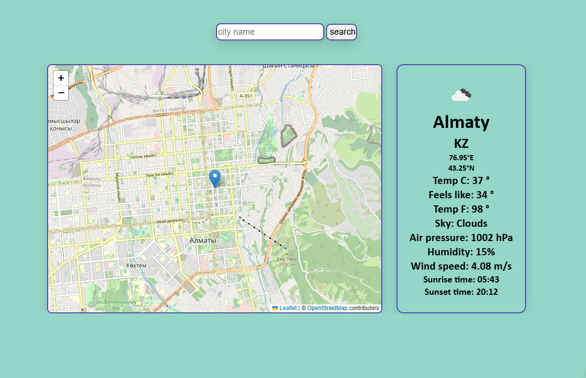
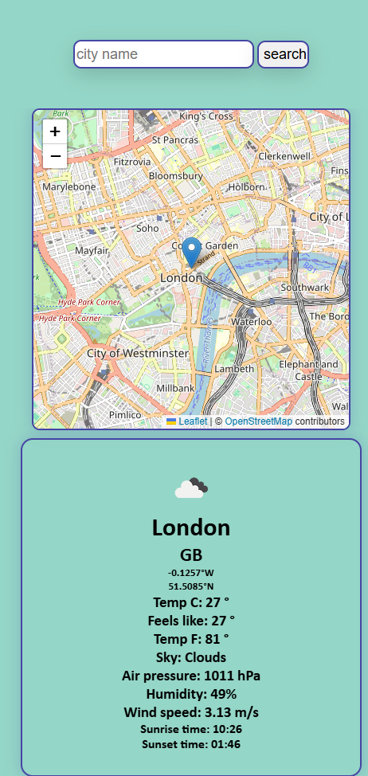

# 🌤 Weather App

A modern weather application built with Vanilla JavaScript.

The application allows users to search for weather information in cities around the world, view the location on an interactive map, and keep a history of recent searches.

Built while learning Front-end Development with a focus on working with APIs, asynchronous JavaScript and browser storage.

---

## 🚀  Demo

## ✨ Features

- 🔍 Search weather by city name
- 🗺 Interactive map with Leaflet
- 💾 Last search saved in Local Storage
- 🕘 Search history
- 🚫 Error handling
- ⏳ Loading spinner
- ✨ Smooth animations with Animate.css.
- 📱 Responsive layout

---

## 🛠 Technologies

- HTML5
- CSS3
- JavaScript (ES6+)
- OpenWeather API
- Leaflet.js
- Animate.css
- Local Storage

---

## 📸 Screenshots

### Desktop version

### Mobile version

---

## Future

This project is considered complete in its Vanilla JavaScript version.

Future work will focus on rebuilding it with React to improve architecture, state management and component reusability.

---

## Contacts

## 👩‍💻 Author

**Irina Bronnikova**

📧 bronnikova702@gmail.com
